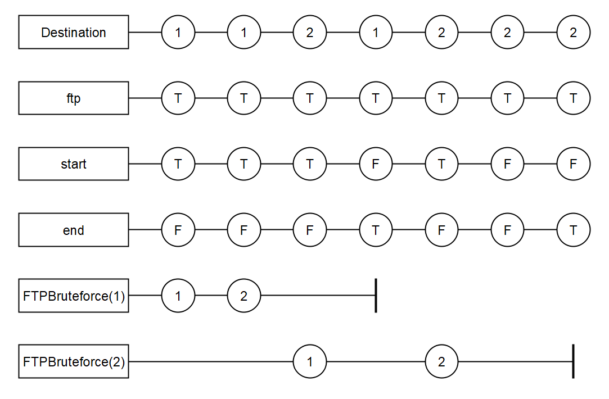

# Parameterization

## Motivation

Parameterization is the ability to group similar data together, to compute properties, and to quantify over them.
For example, in network monitoring, we often compute properties per source IP address.

## Desgin

Readability and familiarity is a major factor in the design of parameterization.

### Syntax

Declaration of parametric outputs is given by the grammar:

```
OUTPUT      := output NAME ( PARAMETERS ) FILTER TERMINATION : TYPE AC := EXPRESSION
PARAMETERS  := (NAME (: TYPE)?)+
FILTER      := filter EXPRESSION
TERMINATION := close EXPRESSION
```

### Semantics

### General

If a parametric stream $x$ with parameters $t_1, ..., t_n$ is accessed with values $v_1, ..., v_n$ we decide between the following two cases:

* If the stream has not yet been accessed with these values, a new instance of the stream is created and the parameters of the stream instance are bound to the values $v_1, ..., v_n$. The stream access to that instance can than be evaluated in the same way as for non parametrized streams.
* Otherwise, the stream access to the existing instance for the values $v_1, ..., v_n$ can be evaluated in the same way as for non parameterized streams.

### Filter
The filter expression should evaluate to a value of type $Bool$. It poses an additional constraint to the activation condition of a stream, i.e. the stream is only evaluated if the activation condition is met and the filter expression evaluates to true.

### Close
The close expression should evaluate to a value of type $Bool$. It determines when an instance of a parametrized stream can be removed from the evaluation context, i.e. it is no longer needed.

### Examples

* parametric declaration `output x(a: Int8, b: Bool) : Int8 := 1`
* Parametric outputs can be used as functions, e.g., `output y := x(1, false)`
* filter conditions `output x filter (x != y) := 1`
* termination condition `output x close x > 10 := x[-1].defaults(to: 0)`

#### Full Example:
```
input Protocol: String, Destination: String, Payload: String, Direction: String
input Src_Port: UInt16

output ftp   := Protocol="TCP" & Src_Port=21 & Direction="Outgoing"
output start := Payload.matches("/530\s+(Login|User|Failed|Not)/smi")
output end   := Payload.matches("/230 \s+(Logged|User|Successful)/smi")

output FTPBruteforce(dst: String): UInt8
                              filter (Destination=dst & ftp & start)
                              close  (Destination=dst & ftp & end)
                            := FTPBruteforce(dst).offset(by: -1).default(to: 0) + 1
                                
trigger ftp & start & FTPBruteforce(Destination) > 5
```

#### An evaluation snapshot:




 